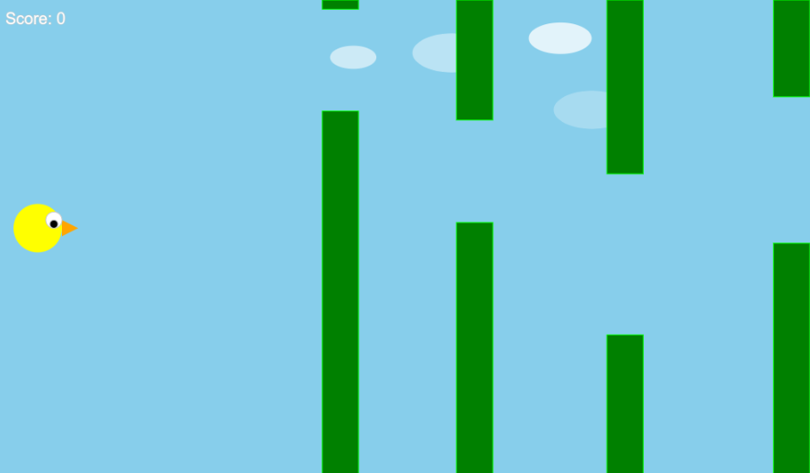

# Flappy Bird Game

## Overview
This project is a simple implementation of the classic Flappy Bird game using p5.js. Flappy Bird is a side-scrolling game where the player controls a bird, attempting to fly between columns of green pipes without hitting them. The game ends when the bird collides with a pipe or the ground.

## Demo
You can play the game live [here](https://progeuler.github.io/flappy-bird/).

## How to Play
- Use the spacebar key to make the bird flap its wings and ascend.
- Avoid hitting the green pipes. Passing through each pair of pipes earns you one point.
- The game ends if the bird collides with a pipe or the ground.

## Installation
To run the game locally, follow these steps:
1. Clone this repository to your local machine.
2. Open the `index.html` file in your web browser.

## Technologies Used
- [p5.js](https://p5js.org/) - A JavaScript library for creative coding and visualization.

## Credits
- Flappy Bird game concept by Dong Nguyen.

## License
This project is licensed under the MIT License - see the [LICENSE](LICENSE) file for details.
